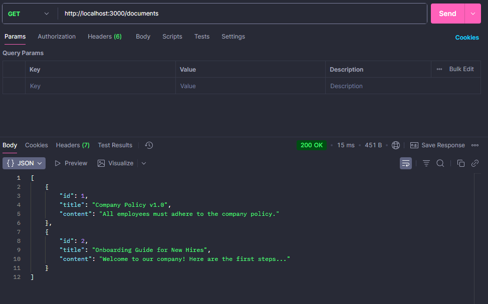
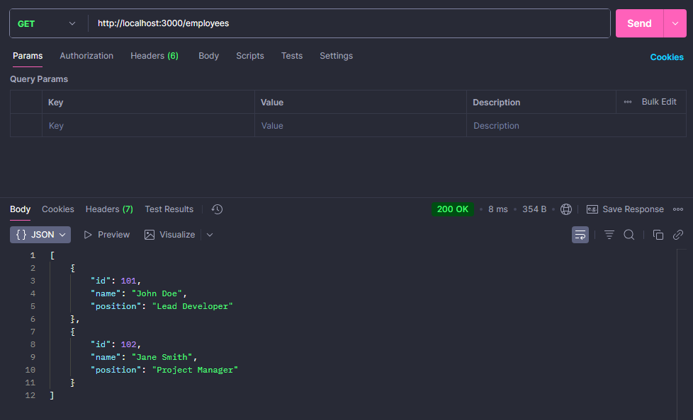
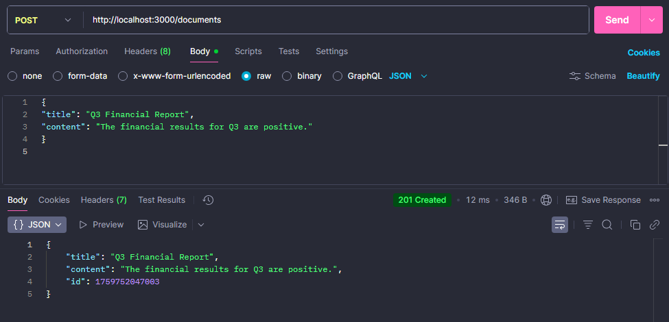
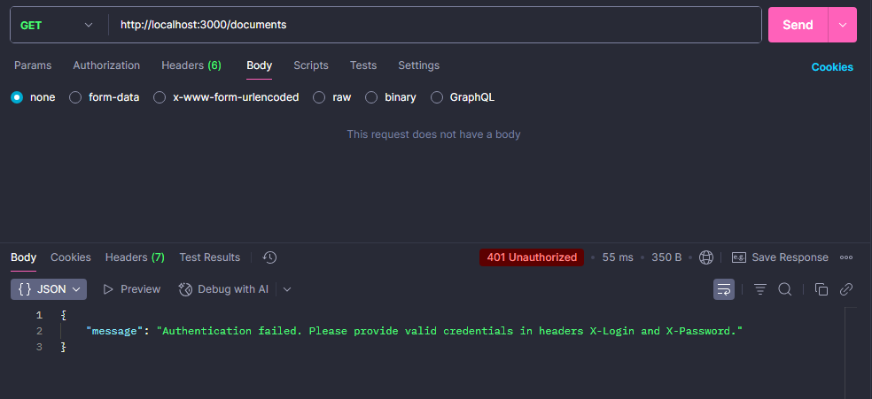
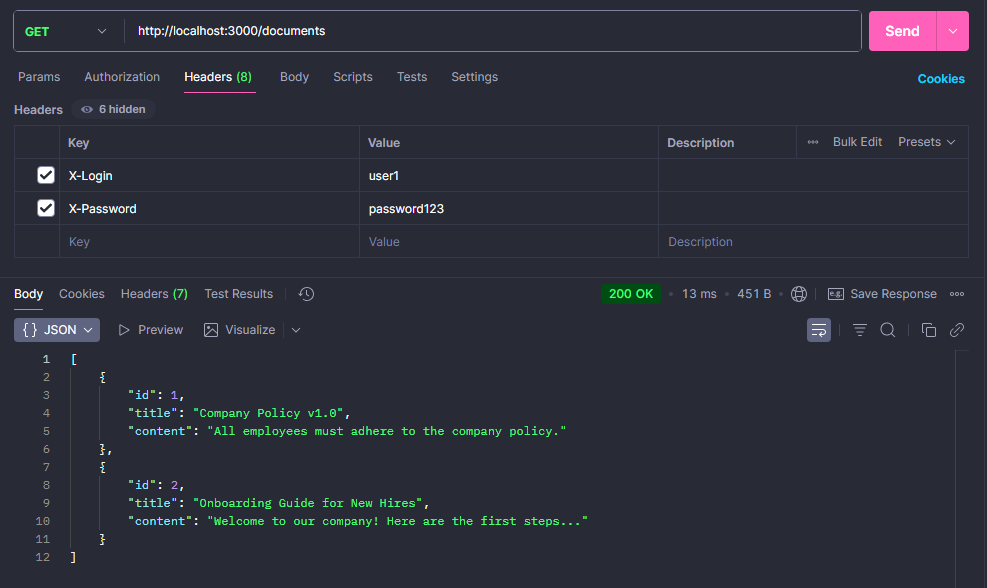
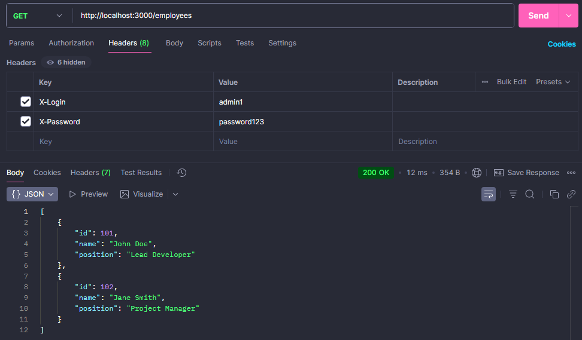

# Лабораторно-практична робота №3
Цей проєкт реалізує **REST API**.  
API підтримує аутентифікацію та авторизацію за ролями, а також демонструє роботу з основними HTTP-методами.  

## Встановлення та запуск
```
npm install
```
```
npm start
```
```
npm test
```

## Структура проєкту

    ├─ data.js          # модуль з даними (користувачі, документи, співробітники)
    ├─ server.js        # основний файл сервера
    ├─ test-client.js   # скрипт для програмного тестування API
    ├─ .gitignore       # ігнорування node_modules та службових файлів
    └─ package.json     # маніфест проєкту
    
## Скріншоти виконання запитів у Postman










## Таблиця ендпоінтів

| Метод  | URL                | Опис                              | Заголовки (Auth)                          | Тіло запиту (JSON)                                  | Коди відповіді |
|--------|--------------------|-----------------------------------|-------------------------------------------|-----------------------------------------------------|----------------|
| GET    | `/documents`       | Отримати список всіх документів   | `X-Login`, `X-Password`                   | –                                                   | 200 OK, 401 Unauthorized |
| POST   | `/documents`       | Створити новий документ           | `X-Login`, `X-Password`                   | `{ "title": "Q3 Report", "content": "..." }`        | 201 Created, 400 Bad Request, 401 Unauthorized |
| DELETE | `/documents/:id`   | Видалити документ за ID           | `X-Login`, `X-Password`                   | –                                                   | 204 No Content, 401 Unauthorized, 404 Not Found |
| GET    | `/employees`       | Отримати список співробітників    | `X-Login`, `X-Password` (роль `admin`)    | –                                                   | 200 OK, 401 Unauthorized, 403 Forbidden |
| GET    | `/non-existent`    | Звернення до неіснуючого ресурсу | `X-Login`, `X-Password` (опціонально)     | –                                                   | 404 Not Found |

## Посилання на репозиторій
🔗 [secure-api-lab (GitHub)](https://github.com/Dusha2/practical-work-3)